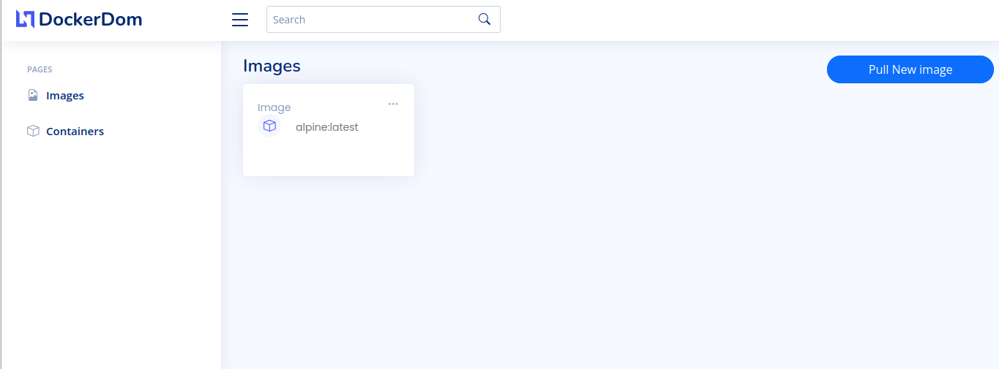

# DockerDom

DockerDom is a cyber security project designed to provide a web interface for controlling and managing Docker containers using the Docker Python package. The project also allows users to communicate with the Docker shell from the web interface. The project is built using the Django web framework and aims to simplify the deployment and management of containers. With Docker Manager, users can easily create, start, stop, and manage Docker containers without the need for complex command-line interfaces.

The platform provides a user-friendly interface that allows users to manage their containers. In addition to container management, Docker Manager also allows users to communicate with the Docker shell directly from the web interface and supports user sessions. With session support, users can log in to Docker Manager and securely manage their containers and resources, with their settings and configurations saved across multiple visits. The platform is built on top of the Django web framework and is designed to be scalable and extensible. Users can create and manage their containers with ease, and the platform provides them with the necessary tools to manage their networks and security configurations. Additionally, Docker Manager provides users with the ability to manage their images and share them with others. With the use of the Docker Python package, the ability to communicate with the Docker shell from the web interface, and session support, Docker Manager can seamlessly integrate with the Docker ecosystem, providing users with access to all of the features and benefits that Docker provides. With Docker Manager, users can easily manage their Docker containers and take advantage of the many benefits that Docker provides.

# Features

1. Web-based user interface: DockerDom provides a user-friendly web interface for managing Docker containers and resources, making it easy for users to create, start, stop, and manage their containers without the need for complex command-line interfaces.

2. Docker Python package integration: Docker Manager integrates with the Docker Python package, allowing users to seamlessly interact with Docker from the web interface.

3. Docker shell communication: DockerDom allows users to communicate with the Docker shell directly from the web interface, providing users with the ability to execute Docker commands without leaving the platform.

4. Session support: DockerDom supports user sessions, allowing users to log in to the platform and securely manage their containers and resources, with their settings and configurations saved across multiple visits.

5. Scalability and extensibility: Docker Manager is built on top of the Django web framework and is designed to be scalable and extensible, allowing users to easily add new features and functionality as their needs evolve.

# Prerequisites

1. Docker Installed on host
2. python3

# How To Install
pip install django \n
pip install docker \n
python3 manage.py runserver \n

# usage:

http://127.0.0.1:8000/

# Screenshot

